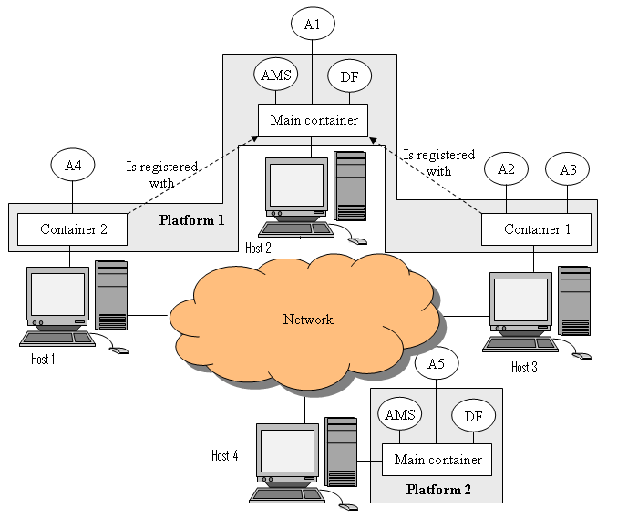

# JADE-Hypermedia

[JADE](http://jade.tilab.com/) is a framework and platform for programming multi-agent systems. This
project implements a hypermedia interface for the JADE platform.

## JADE in a nutshell

A JADE application is composed of agents. Agents execute tasks and interact with one another through
messages. Agents live in containers, which can be distributed across the Internet. In every deployment
of the JADE platform, there is one *main container* that all other containers have to register with.
The main container can be replicated for fault tolerance.



Image source: [Tutorial 1: JADE Architecture Overview](https://jade.tilab.com/documentation/tutorials-guides/jade-administration-tutorial/architecture-overview/)

The main container includes two special agents: one *Agent Management System (AMS)*, which is the main
authority in the system, and one *Directory Facilitator (DF)*, which provides a yellow pages for services
provided by agents on the platform. The AMS and DF are defined by the [FIPA Agent Management
Specification](http://fipa.org/specs/fipa00023/SC00023K.html).

See [JADE Tutorials and Guides](https://jade.tilab.com/documentation/tutorials-guides/) for more
information on JADE.

## About this project

This project implements a *Hypermedia Weaver Agent (HWA)*, a special type of JADE agent that helps
construct a hypermedia interface for a distributed JADE platform. In a distributed deployment, there
must be one HWA per machine to manage the hypermedia interface for all containers deployed on that
machine.

## How to run the project

First build the project with:
```shell
gradle shadowJar
```

Then start a main container with:
```shell
gradle run
```

Open in your browser [http://localhost:3000/](http://localhost:3000/) to see and navigate a Linked Data
view of the system. The above task will also launch the JADE GUI.

To configure the HTTP host and port used by the HWAs for exposing the hypermedia interface, see the
task's arguments in `hwa-lib/build.gradle.kts`.

You can start a regular container on the same machine with:
```shell
gradle startContainer
```

You can run the above task multiple times to start multiple containers on the same machine.

## Developing agents with JADE

See [JADE Tutorials and Guides](https://jade.tilab.com/documentation/tutorials-guides/).
